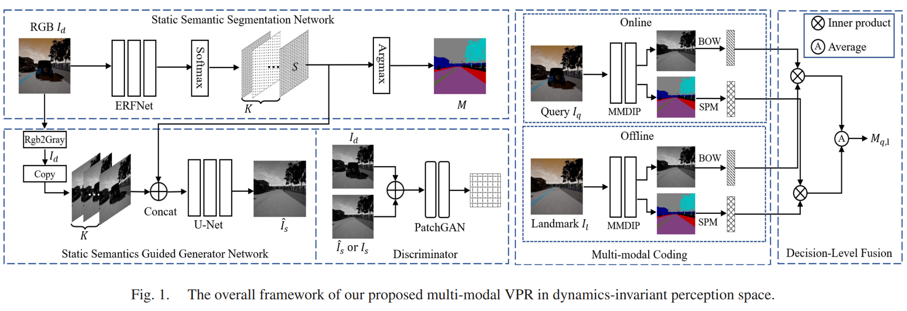

# Multi-modal Visual Place Recognition

> Dataset and code for our IEEE-Signal-Processing-Letter-2020 paper:
> 《[Multi-modal Visual Place Recognition in Dynamics-Invariant Perception Space](https://doi.org/10.1109/lsp.2021.3123907)》

## Highlight

- We build a dynamics-invariant perception space to improve feature matching in dynamic environments, which can be seen as an extension of [Empty Cities (IEEE TRO2020)](https://doi.org/10.1109/TRO.2020.3031267).

- Specifically, we propose a dynamics-invariant perception network to recover the static semantics and static images directly from the dynamic frames. We then design a multi-modal coding strategy to generate the robust semantic-visual features for image matching.

## Framework



## Installation

- Install Torch (tested on 1.2.0)

## Dataset

- Synthetic dataset for dynamic-to-static semantic segmentation [[link]](https://pan.baidu.com/s/1KpuWKwNpkP3xizcLg5k-ww) (Extraction-code: 5250).
- Synthetic dataset for dynamic-to-static image translation [[link]](https://drive.google.com/drive/folders/1aDO7_HtVkCncGew9ZMpDJ9KCT4fYD8hm?usp=sharing).

## Train

```shell
python train_TransNet --dataroot EmptycitiesDataset_path --gpu_ids 0 --name xyz --batchSize x --phase train
```

## Test

```shell
python test_TransNet --gpu_ids 0 --name SegTransNet --phase testRand --epoch x --no_flip
```

## Scripts

- We provide training and testing scripts for static semantic segmentation.

  ```shell
  python train_SegNet --gpu_ids 0 --name xyz --batchSize x --phase trainRand --mode Seg
  ```

  ```shell
  python test_SegNet --gpu_ids 0 --name xyz --epoch x --phase testRand --mode Seg
  ```

- We also provide evaluation scripts for image quality (L1, L2, PSNR, SSIM) and  semantic segmentation performance (PA, MPA, MIoU, FWIoU). Please see *"src/scripts"* for more details. 

## Citation

**BibTex:**

```
@ARTICLE{9594697,
  author={Wu, Lin and Wang, Teng and Sun, Changyin},
  journal={IEEE Signal Processing Letters}, 
  title={Multi-Modal Visual Place Recognition in Dynamics-Invariant Perception Space}, 
  year={2021},
  volume={28},
  pages={2197-2201},
  doi={10.1109/LSP.2021.3123907}}
```

## Acknowledge

- This work was supported by in part by the *Postgraduate Research and Practice Innovation Program of Jiangsu Province under Grant SJCX20_0035*, in part by the *Fundamental Research Funds for the Central Universities under Grant 3208002102D*, and in part by the *National Natural Science Foundation of China under Grant 61803084*.

